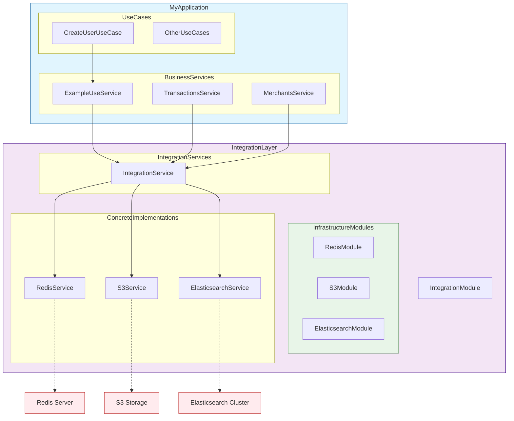

Основная идея формирования интеграционного слоя с классом по предоставлению функционала всех интеграционных модулей. 
Сам модуль объявляется глобально для корректного предоставления функционала из любой точки

